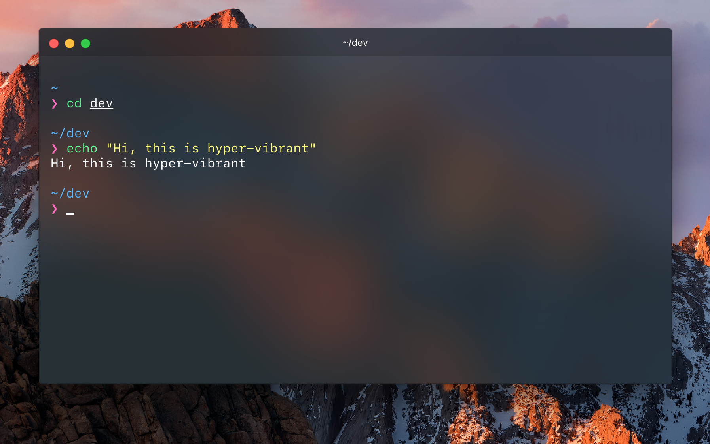

# hyper-vibrant

> [Snazzy](https://github.com/sindresorhus/hyper-snazzy) based [Hyper](https://hyper.is) theme using the Vibrancy API

## Install

Add `hyper-vibrant` to the plugins list in your `~/.hyper.js` config file.

## Tip

To get the exact same look as in the screenshot, you need to use the [Pure](https://github.com/sindresorhus/pure) prompt, SanFrancisco mono font, and the [zsh-syntax-highlighting](https://github.com/zsh-users/zsh-syntax-highlighting) plugin to have commands highlighted.

## License

MIT © [Ignacio Alvarez](https://github.com/nachoaIvarez)
